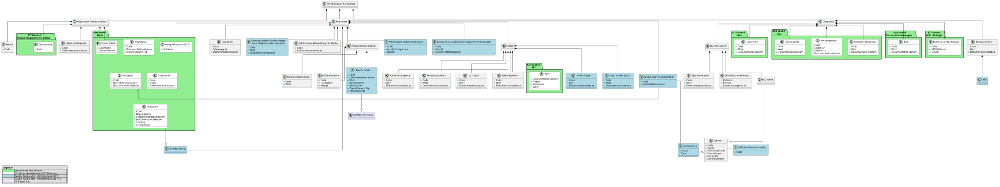

# Informationsmodell (UML) - MII IG Modul Kardio DE v2027.0.0-ballot.rc1

* [**Table of Contents**](toc.md)
* **Informationsmodell (UML)**

## Informationsmodell (UML)

Das Informationsmodell des Kardiologie-Moduls ist im Github-Repository des Moduls Kardiologie verfügbar:

* **[`information-model/Klassendiagramm.puml`](https://github.com/medizininformatik-initiative/kerndatensatz-kardiologie/wiki/files/UML.puml)** (PlantUML-Format)
* **[`information-model/Klassendiagramm.svg`](https://github.com/medizininformatik-initiative/kerndatensatz-kardiologie/wiki/files/UML.svg)** (gerendertes SVG)

## Abbildung des Informationsmodells

Das UML-Klassendiagramm zeigt die zentralen Profile und Beziehungen des Kardiologie-Moduls sowie die Bezüge zu anderen KDS Modulen und FHIR-Packages:

* **Allgemeine Patientendaten** (Demographische Informationen)
* **Anamnese** (Vorerkrankungen, Nicht-Vorliegen, Skalen, etc.)
* **Diagnostik** (Device-Implantation, EKG, etc.)
* **Kardiologische Devices** (Schrittmacher, ICD, CRT, LVAD/BiVAD)
* **EKG Metadaten** (Metadaten, Annotationen, Auswertungsergebnisse, Rohdatenreferenz)

-------

**Hinweis:** Die zur aktuellen Umsetzungsstufe implementierten Profile sind farblich (blau) hervorgehoben. Zusätzliche Klassen werden erst im Rahmen der weiteren Umsetzung des Moduls ausgearbeitet.

